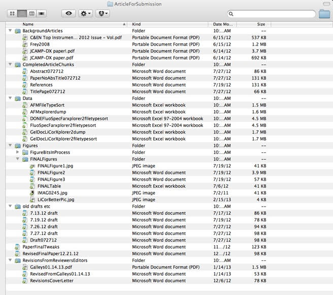

# File Naming

## Why is file naming important?

Creating a well-organized hierarchy of files with clear naming conventions is an important part of improving your research process. This is especially important if you are working with large data sets and complex output files or coordinating with multiple people at multiple institutions. There are many ways to structure your folders, and multiple naming conventions you can use. The key is **consistency**. Make your file names descriptive, and include information about dates and versioning. The best practice is to consult with your lab or with your co-workers to develop a naming schema that everyone is willing to follow consistently.

## *What do you think about the following file names?*

- 10_data 2.txt
- figure 1.png
- final revision.docx
- Lily's schedule&plan 2022Jul9.xlsx

## *What about these names?*
- better-filenames.txt
- 003_raw-data_2022-07-09.txt
- fig01_scatterplot-talk-length-vs-interest.png
- 20220709_interview-script_v01.docx

## This is what happens when you do not have effective naming conventions:

---

## How to make good file names? 
##  Follow 3 principles! 
  

*1*{: .circle .circle-blue} Machine-Readable  

*2*{: .circle .circle-red} Human-Readable  

*3*{: .circle .circle-yellow} Plays Well With Default Ordering 

## *1*{: .circle .circle-blue} Machine-Readable 

**Goal*: The characters in file names should be able to handled by all computer systems, and the names should be brief and easily searchable. 

- Only use the following:

  - Alphanumeric characters (alphabetic characters and Arabic numerials)   

  - Element delimiters: **_(underscore)**
  
  - Word delimiters (within an element): **- (dash)** and/or **capitalize** the first letter of each word (camel case)

      e.g. [element 1]_[element 2]_[WordPart-WordPart-WordPart]_[element 3].txt

- Avoid spaces and special characters, such as: ~ ! @ # $ % ^ & * ( ) ` ; : < > ? . , [ ] { } ' " | 

- Make file names 32 characters or less

- If you decide to abbreviate the elements with 2- or 3-letter codes (e.g. project 1 = P1, mouse = "MUS"), make sure these are well documented 

- Keep case sensitivity in mind - machine searching for files named "Scan" would not find files named "scan"

### Exercise - Make the following file names more machine-readable! 

## *2*{: .circle .circle-red} Human-Readable   

## *Principle 2: Human-Readable*{: .label .label-red}

*Goal*: The file names should provide concise information and be easily understandable to anyone who may access them in future.

- Provide *essential information* concisely in the file name
  - Ideally 3 elements, 5 max.
  - Avoid complex hierarchical folder structures.
- Consider putting authors' names in the file name
  - Put family names first followed by first names or initials.
- Write down your naming convention pattern and **document it** in your README file
  - e.g. My file naming convention is [SA-MPL-EID]_[YYYY-MM-DD]_[###]_[status].[txt]
  - Define acronyms, abbreviations, and codes

## *3*{: .circle .circle-yellow} Plays Well With Default Ordering 

*Goal*: The names should start with the element that is used to order the files and keep versions at the end.

- Decide the beginning of the file name according to how you want to sort and search for your files
  - When using a sequential numbering system, use **leading zeros** to make sure files sort in sequential order. e.g. 001, 002, 010, 011 ....100,101 ...
- Order elements from general to specific to make searching easier
- Versions: should be used as the last element
  - Use ISO 8601 standard for dates: **YYYYMMDD** or **YYYY-MM-DD** 
  - For version numbers, use at least two digits with a leading zero (e.g. v0)
  - Version types (e.g. _raw, _processed, _composite)

### Exercise - Make the following file names more human-readable and play well with default ordering!

## Now you know how to organize files with your own file naming conventions! We .........As long as your names are clear and consistent, you are good to move forward!

## References

    https://datacarpentry.org/rr-organization1/01-file-naming/index.html

    https://authors.library.caltech.edu/103626/1/FileNamingConventionWorksheet_Caltech.pdf

    http://www.exadox.com/en/articles/file-naming-convention-ten-rules-best-practice

    https://datamanagement.hms.harvard.edu/collect/file-naming-conventions