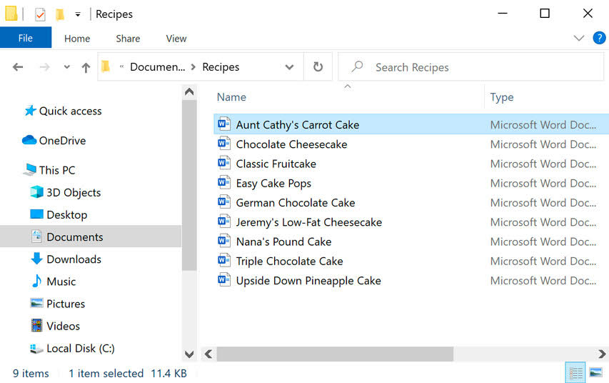
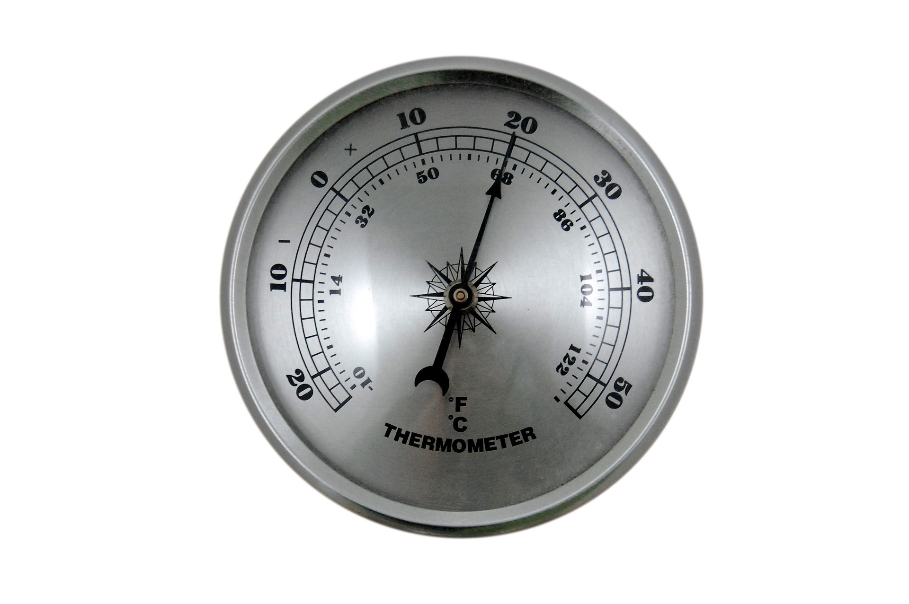

# Why is file naming important? 
{: .no_toc }

Creating a well-organized hierarchy of files with clear naming conventions is an important part of improving your research process. This is especially important if you are working with large data sets and complex output files or coordinating with multiple people at multiple institutions. There are many ways to structure your folders, and multiple naming conventions you can use. The key is <b>consistency</b>. Make your file names descriptive, and include information about dates and versioning. The best practice is to consult with your lab or with your co-workers to develop a naming schema that everyone is willing to follow consistently. 

  

Looking for a cheat sheet? Check out our [one-pager](https://osf.io/pfweq)!
{: .note}
  

  

    Table of contents
  

  {: .text-delta }
 - TOC
{:toc}

---

What do you think about the following file names? 
  &nbsp;&nbsp;&nbsp;&nbsp;&nbsp;&nbsp;- 10_data 2.txt  
  &nbsp;&nbsp;&nbsp;&nbsp;&nbsp;&nbsp;- figure 1.png  
  &nbsp;&nbsp;&nbsp;&nbsp;&nbsp;&nbsp;- final revision.docx
  &nbsp;&nbsp;&nbsp;&nbsp;&nbsp;&nbsp;- Lily's schedule&plan 2022Jul9.xlsx 

 
This is what happens when you do not have effective naming conventions:

 
Are these names better?  
  &nbsp;&nbsp;&nbsp;&nbsp;&nbsp;&nbsp;- better-filenames.txt
  &nbsp;&nbsp;&nbsp;&nbsp;&nbsp;&nbsp;- 003_raw-data_2022-07-09.txt
  &nbsp;&nbsp;&nbsp;&nbsp;&nbsp;&nbsp;- fig01_scatterplot-talk-length-vs-interest.png
  &nbsp;&nbsp;&nbsp;&nbsp;&nbsp;&nbsp;- 20220709_interview-script_v01.docx

---

<h1> Follow three principles!  &nbsp;  </h1> 

*1*{: .circle .circle-blue} &nbsp;Machine-Readable

*2*{: .circle .circle-red} &nbsp;Human-Readable  

*3*{: .circle .circle-yellow} &nbsp;Plays Well With Default Ordering 

 

## *1*{: .circle .circle-blue} &nbsp; Machine-Readable 

Goal
{: .label .label-green }

    - The characters in file names should be able to handled by all computer systems.
    - The names should be brief and easily searchable. 

<h3> Only use the following: </h3>

- Alphanumeric characters (alphabetic characters and Arabic numerials)  

  &nbsp; &nbsp; &nbsp; &nbsp; &nbsp; &nbsp;  

- Element delimiters: **_(underscore)**  
- Word delimiters (within an element): **-(dash)** and/or **capitalize** the first letter of each word (camel case)  
&nbsp;&nbsp;e.g. [element 1]\_[element 2]\_[WordPart-WordPart-WordPart]_[element 3].txt

Avoid spaces and special characters, such as: ~ ! @ # $ % ^ & * ( ) ` ; : < > ? . , [ ] { } ' "  \|   
{: .warn}

<h3> Make sure to do the following: </h3>

- If you decide to abbreviate the elements with 2- or 3-letter codes (e.g. project 1 = P1, mouse = "MUS"), make sure these are well documented.
- Keep case sensitivity in mind - Machine searching for files named "Scan" would not find files named "scan".
  
  

## Exercise 1

Let's try improve the file names! Pick your favourite file name and make it more machine-readable! 

[//]: # (activity link: https://bit.ly/rdmactivity)

 

 

## *2*{: .circle .circle-red} &nbsp; Human-Readable

&nbsp;&nbsp;&nbsp;&nbsp;&nbsp;&nbsp;&nbsp;&nbsp;

Goal
{: .label .label-green }

    - The file names should provide concise information.  
    - They are easily understandable to anyone who may access them in future.
    
  

- Provide **essential information** concisely in the file name
   - Ideally 3 elements, 5 max.
   - Avoid complex hierarchical folder structures.
- Consider putting authors' names in the file name.
   - Put family names first followed by first names or initials.
- Write down your naming convention pattern and **document it** in your README file.
   - e.g. My file naming convention is [SA-MPL-EID]\_[YYYY-MM-DD]\_[###]_[status].[txt]
   - Define acronyms, abbreviations and codes.

&nbsp;&nbsp;&nbsp;&nbsp;&nbsp;&nbsp;&nbsp;&nbsp;

 
 

## *3*{: .circle .circle-yellow} &nbsp; Plays Well With Default Ordering

&nbsp;&nbsp;&nbsp;&nbsp;&nbsp;&nbsp;&nbsp;&nbsp;

Goal
{: .label .label-green }

    - The names should start with the element that is used to order the files.
    - Keep versions at the end.

- Decide the beginning of the file name according to how you want to sort and search for your files.
- When using a sequential numbering system, use **leading zeros** to make sure files sort in sequential order. e.g. 001, 002, 010, 011....100,101 ...
- Order elements from general to specific to make searching easier
- Use ISO 8601 standard for dates: **YYYYMMDD** or **YYYY-MM-DD** 
- Versions: should be used as the last element
   - For **version numbers**, use at least two digits with a leading zero (e.g. v0)
   - Version types (e.g. _raw, _processed, _composite)

&nbsp;&nbsp; &nbsp;&nbsp; &nbsp;&nbsp; 

## Exercise 2 

Your lab has a spectrometer that is measuring thermal emissions **once a day for a year** for your experiment. 
There are three people who take that measurement in the lab. 

Please create a file naming convention for these **.hdf5 files** to reflect what you have learned about file naming in today's session.

[//]: # (activity link: https://bit.ly/rdmactivity)

 

# Congrats!
{: .no_toc }

Now you know how to organize files with your own file naming conventions! As long as your names are clear and consistent, you are good to move forward!

---

# Sources
{: .no_toc }
- https://datacarpentry.org/rr-organization1/01-file-naming/index.html
- https://authors.library.caltech.edu/103626/1/FileNamingConventionWorksheet_Caltech.pdf
- http://www.exadox.com/en/articles/file-naming-convention-ten-rules-best-practice
- https://datamanagement.hms.harvard.edu/collect/file-naming-conventions
- https://pixabay.com