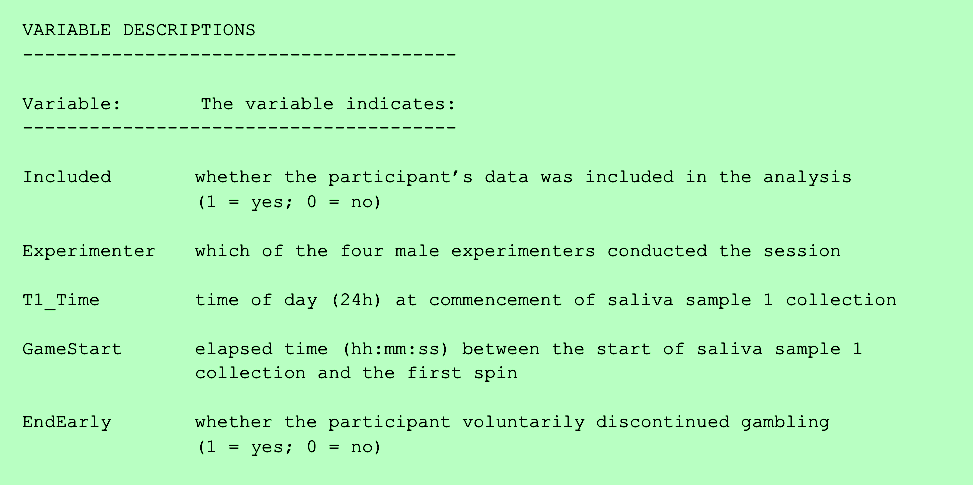

# What is README?
{: .no_toc}

A README is a guide to your dataset and is usually a plain text file to maximize its usability and long-term preservation potential. The purpose of a README is to assist other researchers to understand your dataset, its contents, provenance, licensing and how interact with it. README files are generally named ```README```, ```readme.txt``` or ```read-me.md``` and are included as a component of a dataset.

In short, A README is the portable, durable way to provide information to other researchers about how to use your dataset. 

<p style="margin-bottom: 20px"></p>

Looking for a cheat sheet? Check out our <a href="https://osf.io/aqxw3" target="_blank">one-pager</a>!
{: .note}

<br>

<details open markdown="block">
  <summary>
    Table of contents
  </summary>
  {: .text-delta }
 - TOC
{:toc}
</details>

<p style="margin-bottom: 20px"></p>


<p style="margin-bottom: 30px"></p>


<p style="margin-bottom: 50px"></p>


## README or Metadata for repositories? 

When you deposit your data to data repositories (e.g. Dataverse or FRDR), you are asked ask to provide metadata. A README complements but does not replace the metadata for repositories.

The best practice is to record information in **both** the *repository’s metadata* and the *README*. The repository’s metadata will support findability within and between data repositories while the README is portable and continues to describe the dataset after it has been separated from its original context. In all cases, you should use any conventions appropriate to *your discipline* to record the information about your dataset.

<br>

## Exercise 1
{: .no_toc}
{: .label .label-green }

Please help us to make sense of a dataset.
  
Access a dataset:  

>Clark, Luke, 2019, "Role Reversal: The Influence of Slot Machine Gambling on Subsequent Alcohol Consumption", <a href="https://doi.org/10.5683/SP2/SLOY0N" target="_blank">https://doi.org/10.5683/SP2/SLOY0N</a>, Borealis, V1, UNF:6:zsehCAz4agntvPwDZF03OA== [fileUNF]  

Download the data file <b>"Gambling_Alcohol_Study 1_Archive.tab"</b> in the <b>Original File Format</b>. Examining the data, try to answer the following questions:
1. Describe different gambling conditions in this study.
2. A variable named "ResultingBAC", what does it mean?
3. How was the data collected?

Please share your experience in Padlet.

<p style="margin-bottom: 30px"></p>


<p style="margin-bottom: 50px"></p>

[//]: # (activity link: https://bit.ly/rdmactivity)

---

# How Do I Create a Readme?

## The Content
  
Core elements of *any* README include:

- **Contact information** for the researcher(s)
- The use **license** for your data (unless that is included in a separate file)
- Your data collection **methods** (protocols, sampling, instruments, coverage, etc.)
- The **structure** of files
- **Naming conventions** for files, if applicable
- The **sources** you used
- Your **quality assurance** work (data validation, check-ing)
- Any data manipulations or **modifications**
- Data **confidentiality** and permissions
- The names of labels and variables adn explanations of **codes** and classifications -i.e. a **data dictionary** or a **codebook**

<p style="margin-bottom: 20px"></p>


<p style="margin-bottom: 20px"></p>

Cornell University’s <a href="https://data.research.cornell.edu/content/readme" target="_blank">Guide to writing “readme” style metadata</a> provides a thorough description of the content that you should consider including in your README file. 


<p style="margin-bottom: 50px"></p>

## The Style
  
How you write your README is as important as the information you include. Always remember to be **as clear as possible**. The following are some best practices related to data documentation:

- Don’t use jargon
- Define terms and acronyms
- Make it <a href="https://ubc-library-rc.github.io/rdm/content/01_file_naming.html#1--machine-readable" target="_blank">machine-readable </a> (avoid special characters)

<p style="margin-bottom: 25px"></p>



<p style="margin-bottom: 50px"></p>

## The Process

<p style="margin-bottom: 15px"></p>

**Document your work as you go**, so you don’t lose track of any details. If you wait until the end of your project, you might already have lost or forgotten valuable information.
{: .note}

You can create a README using any text editor (e.g. TextEdit, Notepad++, Atom.io, Sublime Text) or word processor (e.g. Word, LibreOffice). Save your README as UTF-8 encoded text. Using plain text helps preserve your information because it relies on durable, open standards rather than proprietary formats. If you’re using GitHub, your README should be written using <a href="https://docs.github.com/en/get-started/writing-on-github/getting-started-with-writing-and-formatting-on-github/basic-writing-and-formatting-syntax" target="blank">Markdown syntax </a> (readme.md).

<p style="margin-bottom: 25px"></p>


<p style="margin-bottom: 50px"></p>


## Exercise 2
{: .no_toc}
{: .label .label-green }

<p style="margin-bottom: 10px"></p>

Now, let's practice what we just learned. Please <a download href="exercise_files/UBC_README.txt" target="_blank"> download this README
template </a>, choose one data project that you are doing right now and spend 5-7 minutes filling the template. 

Pay special attention to the variables list. A dataset without naming variables is not useful. How would your peers know what a variable named ```OxIntake13``` means?


<br>

# Congrats!
{: .no_toc }

<p style="margin-top:25px;margin-left:30px">

</p>

You are now ready to write up a good README file so other researchers can understand your dataset with no problems!

<br>

---


### Sources
{: .no_toc }
- UBC Library DataGuide. <https://bit.ly/3HtrzM8>
- Cornell University. Guide to writing "readme" style metadata. <https://bit.ly/2W4t9xa>
- The Graduate Institute Geneva. Readme.txt. <https://bit.ly/3aH6AUx>
- GitHub Basic Writing and Formatting Syntax. <https://bit.ly/2y7c4dZ>
- <https://pixabay.com>
- <https://www.pexels.com>

---

Need help?
{: .label .label-blue }
  Please reach out to `research.data@ubc.ca` for assistance with any of your research data questions.