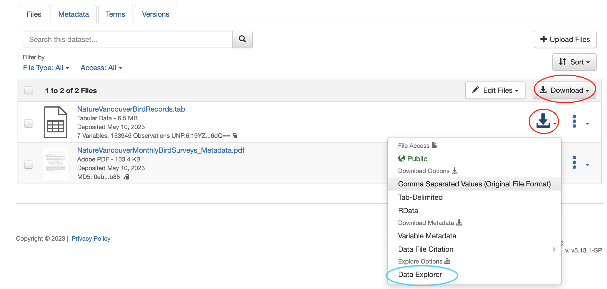
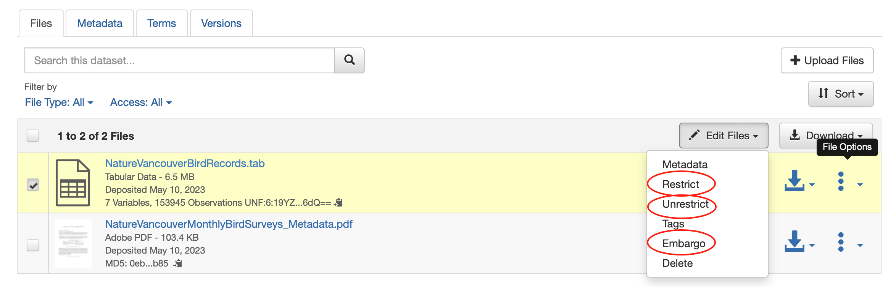
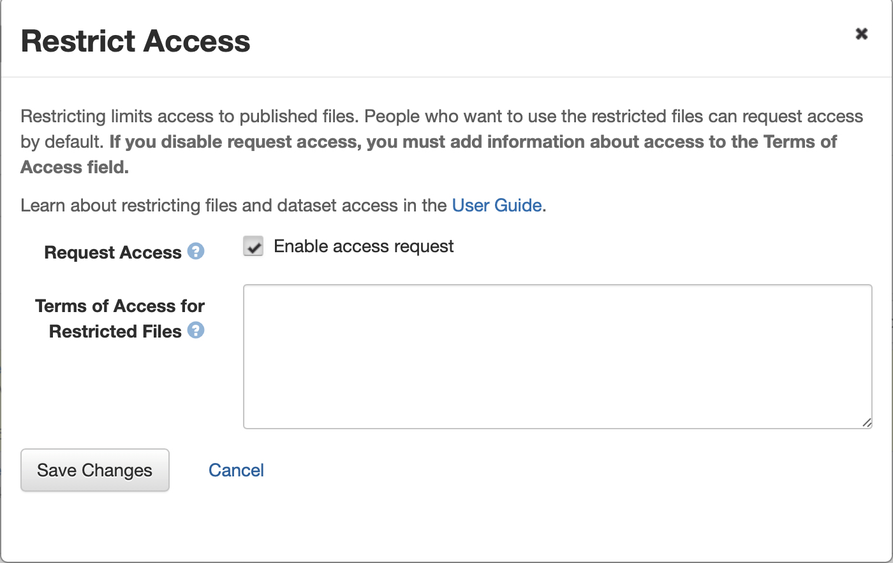
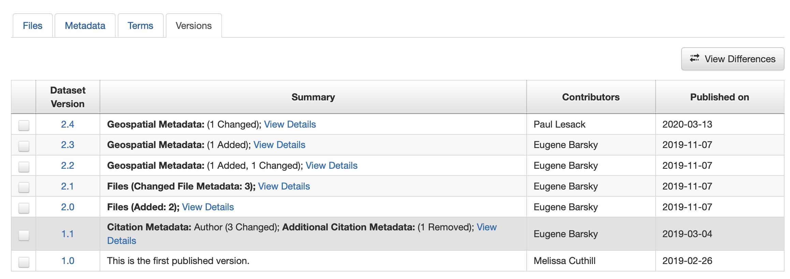
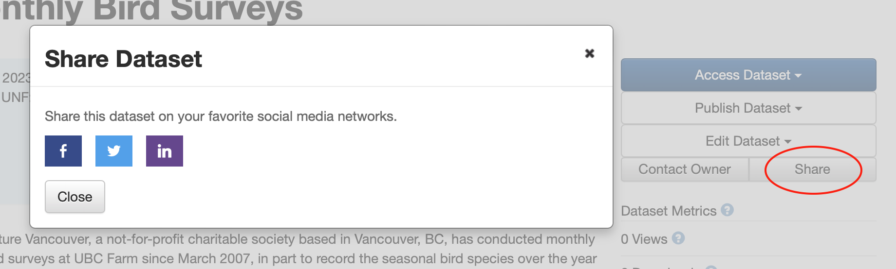
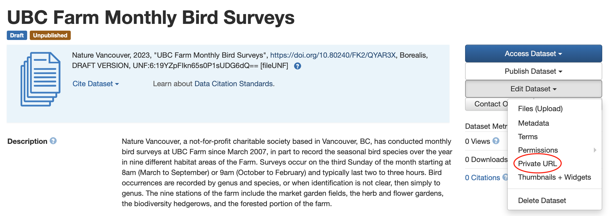
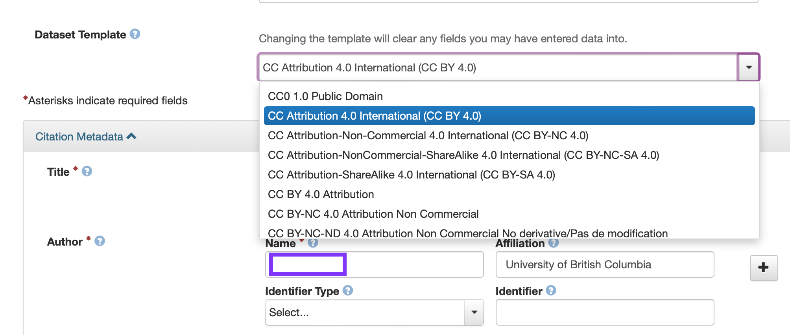
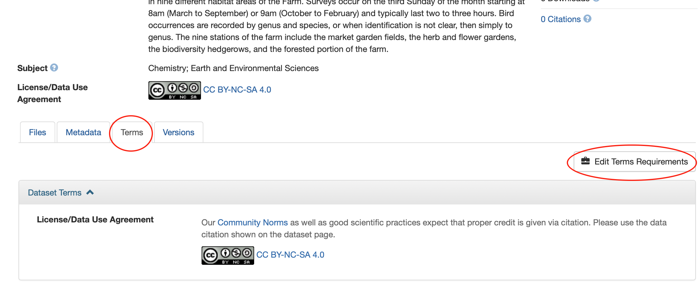

  

    Table of Content
  

  {: .text-delta }
 - TOC
{:toc}

Looking for a cheat sheet? Check out our <a href="https://osf.io/5u4f3" target="_blank">one-pager</a>!
{: .note }

---

# Recommended File formats 

*Any kind of file* can be uploaded to Dataverse, but extra functionality is supported for some filetypes:

## Tabular data
{: .no_toc}

Tabular data (Stata, SPSS, Excel, R, & CS) is <b>normalized to .tab</b> format on upload--a non-proprietary archival format that a variety of programs can read. 

Normalization is important for long-term preservation of digital data. 
The deposited files can be downloaded in multiple formats, but always including the original. 
{: .note}

In Dataverse, tabular normalization also allows you to perform statistical data exploration and visualization *right in your browser*. Click the `Data Explore` button to see what it can do. 

 
 

## Compressed Files (.zip, tar)
{: .no_toc}

Compressed files are the preferred method for uploading large datasets or many files to Dataverse.

**Zip files are automatically extracted on upload**, and the contents will appear as a list under the Files tab. Folder structure and file hierarchy within the zip file are maintained on extraction.

Sometimes, it is a good idea to deposit the zipped folder to preserve the content as it is, especially if you need your files to remain together. In this case, please double-zip your directory and the software will unzip it once upon upload, leaving your directory files together.
{: .note}

# File Size

Borealis is not intended to handle Big Data. Current file size limits are:
- For upload: 3 Gb per file (unlimited number of files in a dataset)
- For tabular normalization: 500 Mb per file (tabular files over this size will remain in their original format, e.g. Excel)

While there is no cap on the overall number of files that you can upload. If your data exceeds 10 Gb, please contact `research.data@ubc.ca` to discuss the best repository options, as we have other solutions (e.g FRDR).
{: .note}

 

# Access Control

Sensitive files can be <b>Restricted</b> or <b>Embargoed</b> so they are not freely available to download. Files can either be fully restricted, or set up so users can send access requests to the contact email for review.

### To restrict, unrestrict, or embargo a file:
{: .no_toc}

 
 

In the popup window, you may *describe the conditions of use* or *license for this file* in the Terms of Access box. 

 
 

Check the `Enable access request` box to allow users to send the contact person an email asking for permission to download a restricted file. Click `Save Changes` to finish.

Files can also be unrestricted if the terms change--for example, once an embargo period has passed. 

 

# Version control

Every change made to a dataset—adding files, editing metadata, etc—is saved as a new version of the dataset. This allows you to track the change history of the project, which can be viewed under the `Versions` tab. This is useful if you need to roll back to a previous version, or find out who made what changes and when.

 
 

 

# Sharing Data

## Where can UBC Dataverse Collection datasets be discovered?

Data deposited in UBC Dataverse Collection is indexed by, and integrated with, many services on the Web, including:

- <a href="http://datacite.org" target="_blank">**DataCite**</a>
- <a href="https://orcid.org/" target="_blank">**ORCID**</a>
- <a href="https://www.lunaris.ca/en" target="_blank">**Lunaris**</a>: a scalable, national research data discovery service
- **Google/Google Scholar/Google Data**
- <a href="https://www.openaire.eu" target="_blank">**OpenAIRE**</a>
- **Any APIs**

## Social Media
Spread the word about your research and improve your altmetrics by sharing your linked data on social media!

Dataverse provides a `Share` button for
1. each Dataverse collection
2. each dataset

 
 

This button gives you the option to create a post with a link to your data on Facebook, Twitter, Linkedin.

## Linking to your dataset

There are 2 main ways to direct people to your dataset:

### *1*{: .circle .circle-blue} &nbsp;DOI 
{: .no_toc}

A **a DOI (Digital Object Identifier)** is assigned to the dataset by Borealis when the first Draft is created. Once the dataset is **Published**, anyone can use the DOI link to find it. While the dataset is still **unpublished**, the DOI can only be used by Dataverse *account holders* with permission to view that Dataverse.

Use DOIs in citations, on your personal or research group website, in publications, and anywhere else you want to be sure the link to your data is stable over time

Click <a href="https://researchdata.library.ubc.ca/plan/get-dois/" target="_blank">here</a> for more information about UBC DOIs.

### *2*{: .circle .circle-red} &nbsp;Private URL
{: .no_toc}

A **temporary link** for use with **unpublished** data. The dataset can only be seen by those who have the link, and users *do not need a Dataverse account*. Great for giving pre-publication access to journals, reviewers, and collaborators.

To create a Private URL, click `Private URL`. The generated URL can be access from this location until the dataset is published, so you can copy it again and again as needed. The Private URL will automatically disappear once the dataset is published.

 

 

## Licenses and Terms

You have control over how your data can be used. Dataverse allows for a variety of licenses and terms of use.

### **Built-in License Templates** 
{: .no_toc}

Templates can be selected at dataset creation, and changed at any time. These automatically apply the right information about the license to the dataset’s metadata.

 

 

You can use this <a href="https://copyright.ubc.ca/creative-commons/" target="_blank">UBC Library Copyright page </a>  to decide what license to use with your dataset. We recommend **CC-BY or CC-0** license for your data.  
{: .note }

 

### **Custom license**
{: .no_toc}

One-size-fits-all licenses don’t suit every dataset. You can create customized terms and conditions of use. 

To customize terms: 

 

If you need help creating a custom license, contact `research.data@ubc.ca`.

