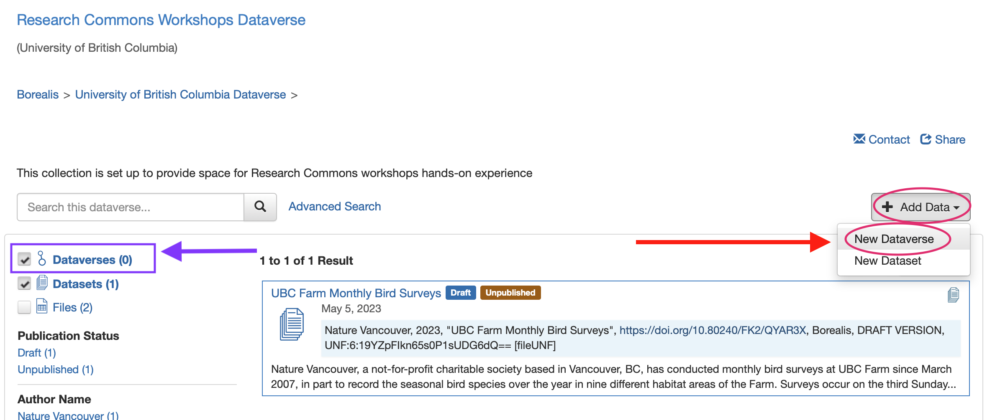
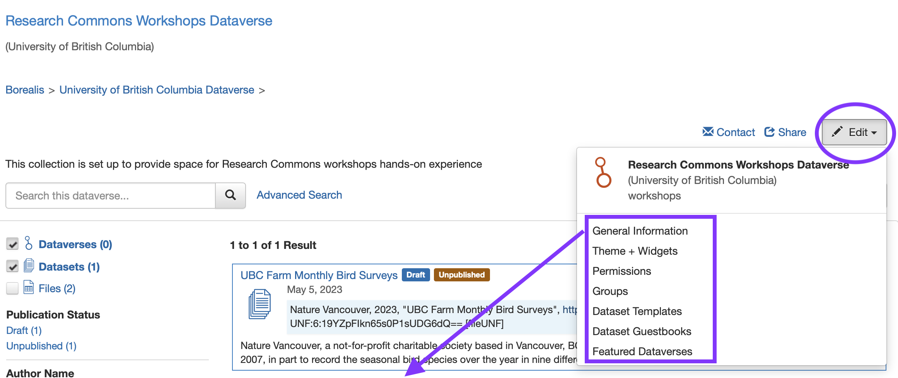
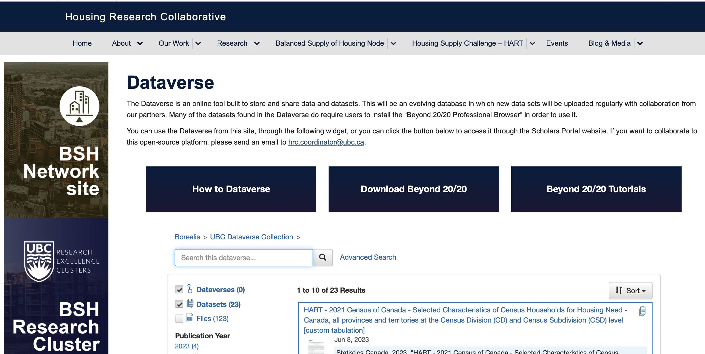
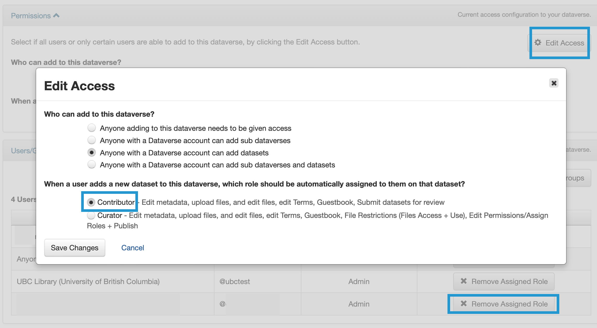
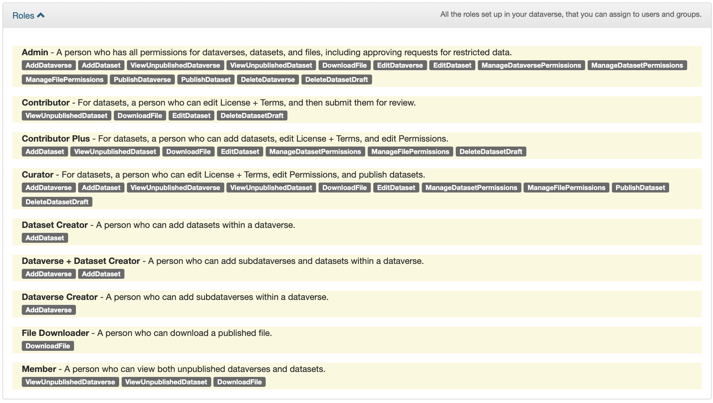
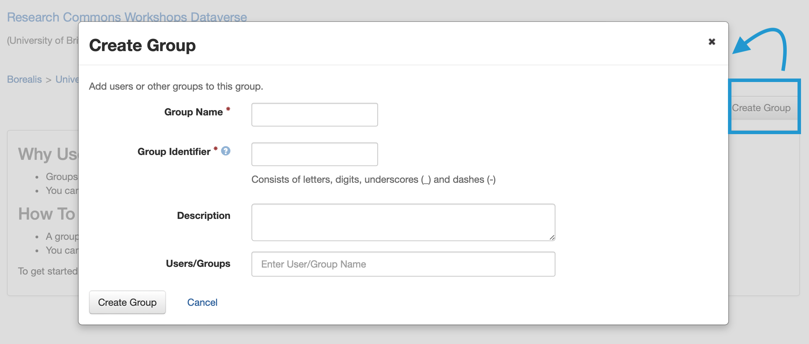
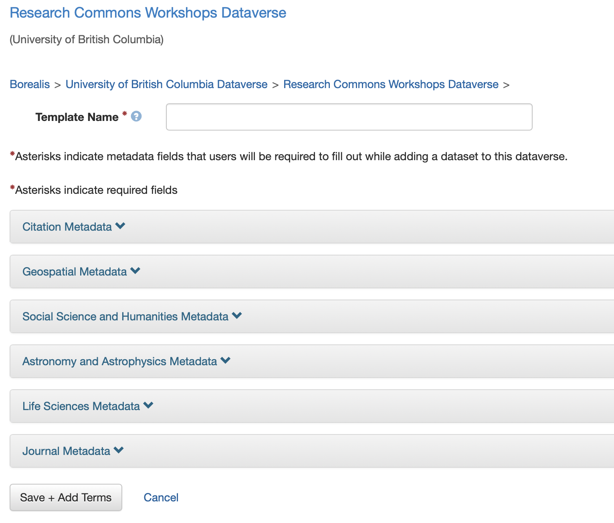
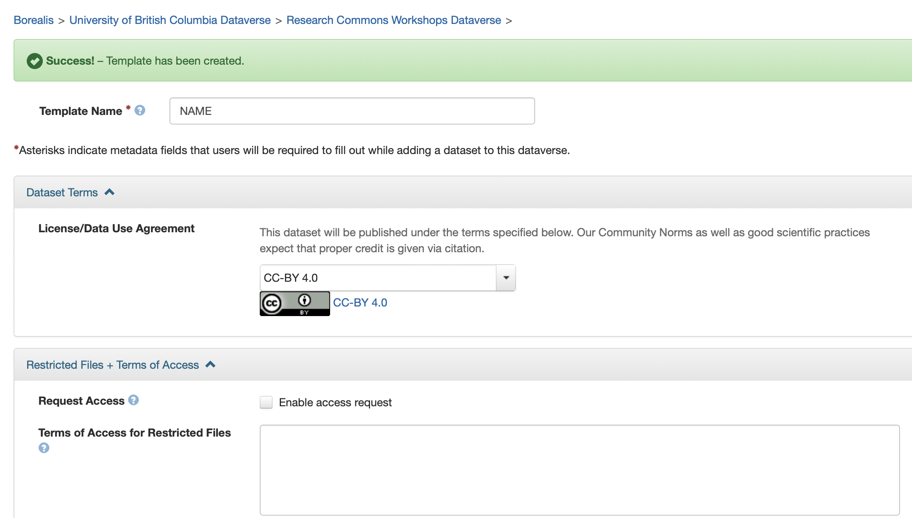
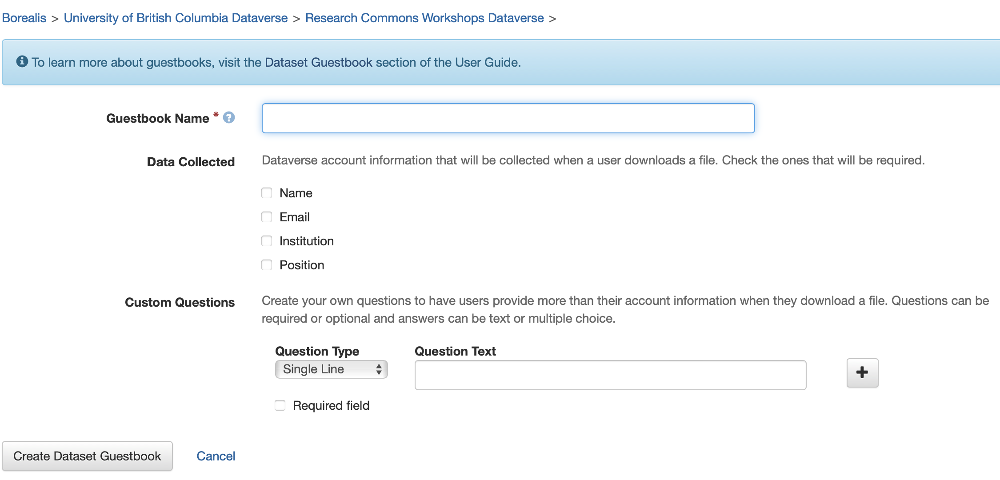

# Admin Access in UBC Dataverse Collection
{: .no_toc}

Some users, such as data managers or curators, have more options to customize and control the way their Dataverse collections look and act. To get an admin access to your Dataverse collection, please reach out to us at `research.data@ubc.ca`.

  

    Table of Content
  

  {: .text-delta }
 - TOC
{:toc}

Looking for a cheat sheet? Check out our <a href="https://osf.io/2f5wg" target="_blank">one-pager</a>!
{: .note }

---

## Create A New (Sub-) Dataverse Collection

From the main page of the Dataverse collection within which you’d like to create a sub-Dataverse collection (for example, the *Research Commons Workshops Dataverse*), click `+Add Data` > `New Dataverse` to create a sub-Dataverse collection.

 
 

 Fill in the form with your desired specifications, and click `Create Dataverse`. 
 
 The Dataverse collection can then be accessed from the `Dataverses` link in the filter column to the left, or simply listed in the Results within its host Dataverse collection.

 

## Customize A Dataverse

On the main page for the Dataverse collection you want to customize, click the `Edit` button and you will then see a dropdown menu with several options:

 
 

 

### <a style="font-size:17px">General Information</a>
{: .label .label-yellow }

You can change basic information about the Dataverse collection, such as:

- Collection name
- URL
- Category (institutional, lab, research group...)
- Affiliation
- Add a logo for your research group
- Description
- Contact Information
- Metadata Fields (that are available or required for data deposit)

 

### <a style="font-size:17px">Theme + Widgets</a>
{: .label .label-yellow }

### Theme
{: .no_toc}

You can change the look of the Dataverse collection, including colour scheme, adding a logo, tagline, and website link. You can also choose to inherit theme from the University of British Columbia Dataverse collection.

 
 

### Widgets
{: .no_toc}

If you want to display your Dataverse collection or dataset on your personal or project website, Borealis provides code for two widgets:

1. Dataverse collection <b>Search Box Widget</b> allows users to search your Dataverse collection without leaving your site
2. Dataverse collection <b>Listings Widget</b> shows all your Dataverse collections and datasets and allows users to view their contents and even download files directly from your site.  

    An example of listings Widget from our colleagues at the <a href="https://housingresearchcollaborative.allard.ubc.ca/dataverse/">UBC Housing Research Collaborative</a>:

 
 

How to get the widget code?
{: .label .label-blue }

1. Go to the main page of a published Dataverse collection or dataset,
2. `Edit` > `Theme & Widgets` or `Thumbnail & Widgets`> `Widgets` tab,
3. Copy the code displayed and paste it into your website’s HTML code.

 

### <a style="font-size:17px">Permissions</a>
{: .label .label-yellow }

Here you can refine who has access to your Dataverse collection, and what actions they can perform. 

The Permissions page has the following tabs:

- <b>Permissions</b>: Clicking `Edit Access` allows you to decide who can create new sub-Dataverse collections and datasets. You can also set the Role that is automatically assigned to those depositing datasets, which determines their editing permissions (recommended role: Contributor).

 
 

- <b>Users/Groups</b> allows you to `Assign Roles to Users/Groups` (must know their user/group name) or `Remove Assigned Role`. 

- <b>Roles</b> Shows you the permitted actions for each role.The UBC Dataverse collection has eight possible roles with differing levels of permissions. Please reach out to us at `research.data@ubc.ca` to help you decide what roles to assign within your dataverse collection.

 
 

 

### <a style="font-size:17px">Groups</a>
{: .label .label-yellow }

If you need to assign different roles to many different users (e.g. multiple collaborators, research groups), `Create Group` can streamline the process. 

 
 

1. Click `+ Create Group`
2. Assign the group a name, identifier, description
3. Type the users' names or user IDS in `Users/Groups`, and Dataverse collection will suggest matching users. 

Once the group is created, you can Edit or Delete it from the Groups page. Groups can then be assigned Roles from the Permissions page (described above).

 

### <a style="font-size:17px">Dataset Templates</a>
{: .label .label-yellow }

If you will be uploading a lot of files with *some identical metadata* (e.g. several files in a series with the same authors, dates, keywords, etc), you can create custom templates to **autofill** those fields. 

In the dataverse collection where you want the template, click  `+ Create Dataset Template`. This will open a form with every possible metadata field. 

 
 

1. Fill in the fields with the information you want to be autofilled for all datasets using that Template. 

2. Give the Template a name

3. Click `Save + Add Terms`. Next, you will fill in any terms, conditions, or requirements for using data assigned that Template. 

4. To finish, click `Save Dataset Template`. The Template will now appear on the Dataset Templates page, where it can be viewed, edited, or deleted.

 
 

 

### <a style="font-size:17px">Dataset Guestbooks</a>
{: .label .label-yellow }

Guestbooks is another way to further control your data access. See for example how our colleagues at the Centre for Sustainable Food Systems at UBC Farm manage their datasets within their <a href="https://borealisdata.ca/dataverse/UBC_CSFS"> Dataverse collection</a>. Once you create a Guestbook, when a user attempts to download a dataset, a popup will ask them for information you specify: name, email, institution, position, or custom questions. Any of these questions can be set as Required to permit the download.

 
 

 

