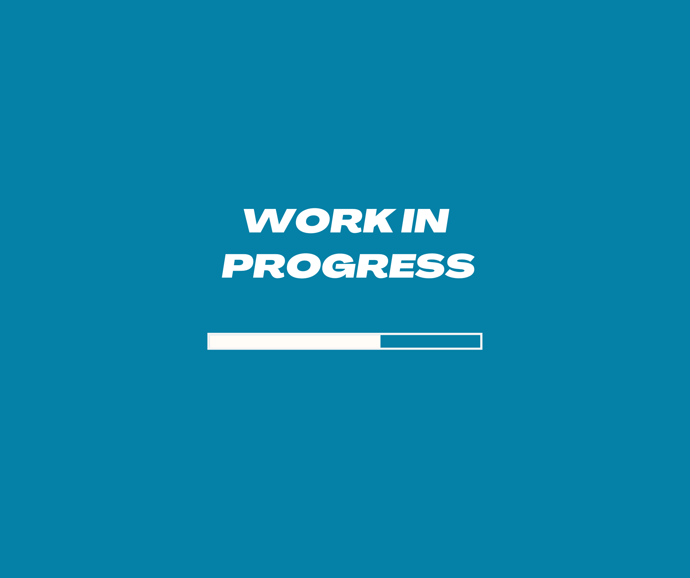
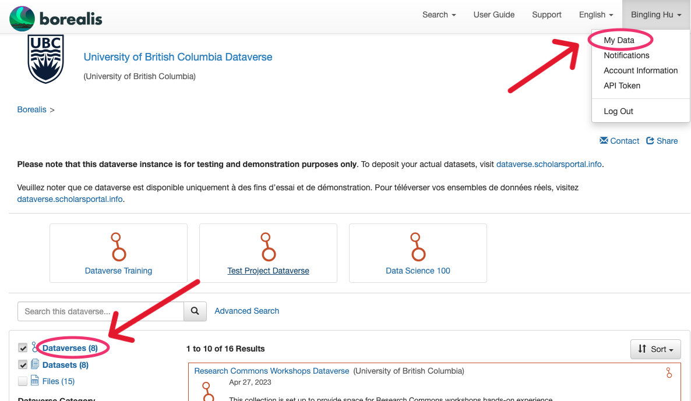
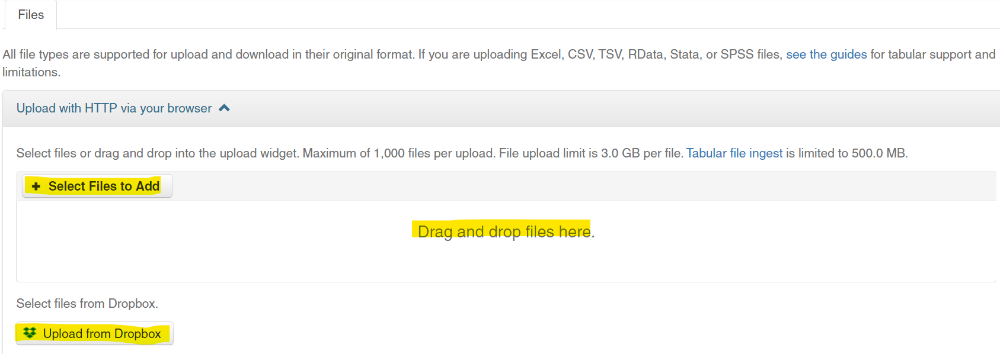
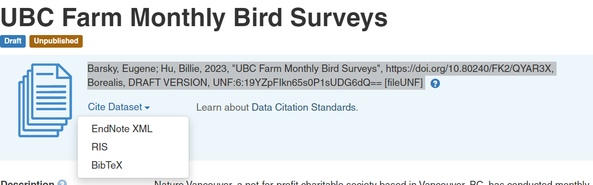

# What is UBC Dataverse Collection @Borealis?
{: .no_toc }

<a href="https://borealisdata.ca" target="_blank">Borealis</a>, the Canadian Dataverse Repository, is a bilingual, multidisciplinary, secure, Canadian research data repository, supported by academic libraries and research institutions across Canada. Borealis supports open discovery, management, sharing, and preservation of Canadian research data stored entirely on Canadian servers. 

<b>UBC Dataverse Collection</b> is a cross-disciplinary research data collection on Borealis. Datasets in the Dataverse collection are discoverable by Google, UBC Library Summon, FRDR, DataCite, and much more. It is an open-source application to publish, share, reference, cite, extract and analyze research data. 

UBC Library can create a Dataverse setup for your research group where you can actively manage your data, share it securely with colleagues, provide version control, establish a permanent data citation, get a DOI for your dataset, and more. All Dataverse files are digitally preserved (Level 1 preservation).

Looking for a cheat sheet? Check out our <a href="https://osf.io/sczv5" target="_blank">one-pager</a>!
{: .note }

  

    How to deposit in UBC Dataverse Collection?
  

  {: .text-delta }
 - TOC
{:toc}

---

# How to deposit in UBC Dataverse Collection?
{: .no_toc}

The following step-by-step instructions will allow you to practice depositing data in a **Demo** UBC Dataverse instance. To deposit your actual datasets, visit `https://borealisdata.ca`.
{: .warn }

## Practice Dataset
{: .no_toc}

Title
{: .label .label-green}

UBC Farm Monthly Bird Surveys

Author(s)
{: .label .label-green}

Nature Vancouver

Abstract
{: .label .label-green}

Nature Vancouver, a not-for-profit charitable society based in Vancouver, BC, has conducted monthly bird surveys at UBC Farm since March 2007, in part to record the seasonal bird species over the year in nine different habitat areas of the Farm. Surveys occur on the third Sunday of the month starting at 8am (March to September) or 9am (October to February) and typically last two to three hours. Bird occurrences are recorded by genus and species, or when identification is not clear, then simply to genus. The nine stations of the farm include the market garden fields, the herb and flower gardens, the biodiversity hedgerows, and the forested portion of the farm.

Click to Download the Files
{: .label .label-green}

- <a download href="exercise_files\NatureVancouverBirdRecords.csv" target="_blank"> The Data file</a>

- <a download href="exercise_files\NatureVancouverMonthlyBirdSurveys_Metadata.pdf" target="_blank"> The metadata/data dictionary file</a>

 

## *1*{: .circle .circle-blue} &nbsp;Create Account

1. Go to <a href="https://demo.borealisdata.ca/dataverse/ubc" target="_blank">the Borealis **Demo** </a> > Login (at top right)
2. Locate UBC and use your CWL to create an account. You will be redirected to the <b>UBC Dataverse Collection</b>.

 

## *2*{: .circle .circle-red} &nbsp;Create Dataset

### 1. Choose the dataverse you want to deposit data into.
{: .no_toc }

Choose `Research Commons Workshops Dataverse` for this exercise

You can find dataverses via: 

### 2. Create a new dataset
{: .no_toc }

- Choose `+Add Data` > `New Dataset` (not New Dataverse) from the dropdown menu

- Select a <b>dataset template</b> for the desired Creative Commons license (default license is CC0). Selecting a template will clear all other data fields, so do this first. 

- Fill in <b>required metadata</b> fields marked with a *.

If desired, fill in additional metadata fields. *Recommended: Keywords, Related Publications*. Many more metadata fields become available for editing after your dataset is saved.
{: .note }

- Click `Save Changes` button. This saves the dataset in **Draft** form; it is **not yet published** nor publicly visible. You can save the dataset without uploading files. 

### 3. Upload data files
{: .no_toc }

The Files section is at the bottom of the page. 

You can upload files now:

<b>Max file size: 3Gb</b>. If your files are too large, try putting them into a Zip file(s), or contact research.data@ubc.ca for help.

By default, the software will unzip your directory. If you want to preserve directory structure, you can double-zip that directory before uploading
{: .note }

<b>Describe the files</b>: Title, Description, Tags. Remember that people can’t use your data if they don’t know what it is!

## *3*{: .circle .circle-yellow} &nbsp;Submit or Publish Dataset

Depending on your user permissions, you will have a button for either:
- `Submit for Review` (the draft dataset is re-viewed by a research data admins)
- `Publish` (makes the dataset publicly available)

Once a dataset is published, Dataverse assigns a **DOI** to permanently identify the dataset.  

We can also assign a **Private URL** to share with a journal and/or peer-reviewers without publishing the data. 

## *4*{: .circle .circle-purple} &nbsp;Edit Dataset  

You can edit elements of your dataset at any time using the `Files`, `Metadata`, and `Terms` (license and use permissions) tabs at the bottom of the page. 
  
Files can be `Restricted` or `Embargoed` so they are available only on request.

Changes made to Files, Metadata, or Terms <b>after publishing</b> your dataset will be saved as a Draft version. Click `Submit for Review` or `Publish` again to make the changes go live; the new version will supersede the old.

Admin assistance is needed to un-publish a dataset, so be sure before Submitting or Publishing.
{: .warn }

## *5*{: .circle .circle-green} &nbsp;Cite Dataset

The data citation is generated by Dataverse based on the required metadata you entered. It’s displayed in a blue box below the dataset title and version #. 

Copy and paste, or use the `Cite Dataset` button to export the citation into EndNote, RIS, or Bibtex.

 
 

 

# Congrats!
{: .no_toc }

Now you know how to deposit your dataset in a **Demo** UBC Dataverse Collection!

  

 

---

### Sources
{: .no_toc }
