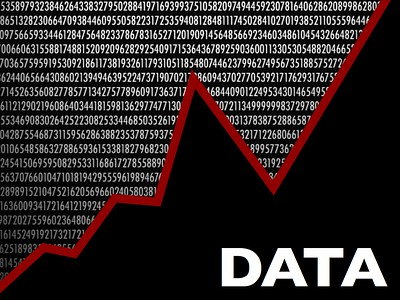

# Why Deposit Data?

Storing your data in a repository like Borealis makes it easy for other researchers, publishers, and collaborators to find, use, and cite your data. It supports the Open Science movement goals of transparency, accessibility, and collaboration, and can increase attention to your work.

Further, the Tri-Agency in Canada (NSERC, CIHR, SSHRC) have introduced <a href="https://science.gc.ca/site/science/en/interagency-research-funding/policies-and-guidelines/research-data-management/tri-agency-research-data-management-policy" target="_blank">a policy</a> requiring some grant recipients to deposit their project data in a repository.

# What is UBC Dataverse Collection @Borealis?
{: .no_toc }

<a href="https://borealisdata.ca" target="_blank">Borealis</a>, the Canadian Dataverse Repository, is a bilingual, multidisciplinary, secure, Canadian research data repository, supported by academic libraries and research institutions across Canada. Borealis supports open discovery, management, sharing, and preservation of Canadian research data stored entirely on Canadian servers. 

<a href="https://borealisdata.ca/dataverse/ubc" target="_blank"><b>UBC Dataverse Collection</b> </a>is a cross-disciplinary research data collection on Borealis. Datasets in the Dataverse collection are discoverable by Google, Google Data, Google Scholar, US National Library of Medicine, UBC Library Summon, Lunaris, DataOne, DataCite, and much more. It is an open-source application to publish, share, reference, cite, extract and analyze research data. 

UBC Library can create a Dataverse setup for your research group where you can actively manage your data, share it securely with colleagues, provide version control, establish a permanent data citation, get a DOI for your dataset, and more. All Dataverse files are digitally preserved (Level 1 preservation).

<iframe width="560" height="315" src="https://www.youtube.com/embed/avjAsnYVZrY" title="YouTube video player" frameborder="0" allow="accelerometer; autoplay; clipboard-write; encrypted-media; gyroscope; picture-in-picture; web-share" allowfullscreen></iframe>

---

Need help?
{: .label .label-blue }
  Please reach out to `research.data@ubc.ca` for assistance with any of your research data questions.

