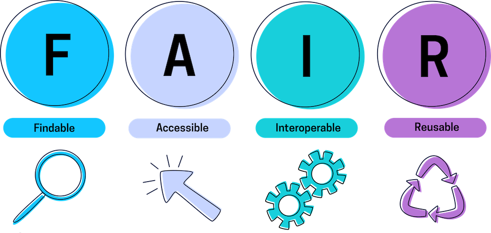
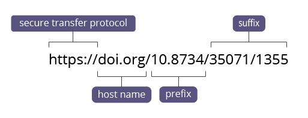

# Deposit, Reuse, Preservation
{: .no_toc}

Remember <a href="https://ubc-library-rc.github.io/rdm/content/06-2_Documentation_Metadata.html#is-your-data-fair" target="_blank">FAIR Data Principles</a>? Everything you have been doing so far is to support the reusability of your digital assets! Now it's time to take your data management one step further!

  

    Table of Content
  

  {: .text-delta }
 - TOC
{:toc}

---

## Why deposit data?

Storing your data in a repository like <a href="https://researchdata.library.ubc.ca/deposit/dataverse/">Borealis</a> makes it easy for other researchers, publishers, and collaborators to find, use, and cite your data. It supports the Open Science movement goals of transparency, accessibility, and collaboration, and can increase attention to your work.

Moreover, the Tri-Agency in Canada (NSERC, CIHR, SSHRC) have introduced <a href="https://bit.lv/2H3mGLv" target="_blank">a policy</a> requiring some grant recipients to deposit their project data in a repository.

Image: <a href="https://medium.com/fluree/making-data-f-a-i-r-93629e82c459" target="_blank">medium.com</a>.

 

## Data Preservation

What is your plan for long time access? Research data preservation involves ensuring that research data remains accessible, usable, and understandable over time. 

 

The preservation process encompasses:
- converting data into sustainable formats,
- storing it in secure repositories,
- viruses control, 
- providing comprehensive metadata and documentation.

When considering what data should be preserved, it's important to note that **not all data you create needs to be preserved**. In some areas of science,  it is often less expensive to resequence the data sample than to store all the data, especially in the preservation layer. Factors such as the value of your data and funding requirements should be taken into consideration. 

Consult with <research.data@ubc.ca> as needed to make informed decisions about which data, if any, should be digitally preserved.

 

## Data Types
When you are working with data, you may encounter different forms of data, such as **raw, processed, analyzed, and final**. Depending on your research project and goals, you may need to use one or more of these forms of data. However, before you decide which form of data to use or deposit, you should check if your funder or publisher has any specific requirements or preferences for data deposition. This way, you can ensure that your data meets the standards and expectations of your target audience.

 

## File Formats
In terms of data preservation, it is advisable to consider using open file formats, preferably non-proprietary ones, that support long-term preservation. 

For guidance on preferred file formats, you can refer to our <a href="https://ubc-library-rc.github.io/rdm/content/02_file_formats.html#we-recommend-these-common-file-formats" target="_blank">File Formatting workshop</a>.
{: .note }

 

## Data Repositories
Storing your data in a repository like <a href="https://researchdata.library.ubc.ca/deposit/dataverse/">Borealis</a> makes it easy for other researchers, publishers, and collaborators to find, use, and cite your data. It supports the Open Science movement goals of transparency, accessibility, and collaboration, and can increase attention to your work.

 
 

UBC Library provides access to two robust, nationally-supported repositories for your data:

|Repository|Description|Digital Preservation|
|:----:|:----:|:----:|
|<a href="https://researchdata.library.ubc.ca/deposit/dataverse">UBC Dataverse Collection</a> (Borealis)|An open-source application to publish, deposit, reference, cite, extract and analyze research data. UBC Library can create a Dataverse setup for your research group where you can actively manage your data, share it securely with colleagues, provide version control, establish a permanent data citation, get a DOI for your dataset, and more.| All Borealis files are digitally preserved with <a href="https://borealisdata.ca/preservationplan/">Level 1 </a>digital preservation|
|<a href="https://researchdata.library.ubc.ca/deposit/frdr/">FRDR</a>| The Federated Research Data Repository, is a Canadian national research data repository for big data. It allows researchers to discover, share, and download Canadian research data.| All FRDR files are preserved with Level 2 digital preservation (Archivematica)|

Refer to our <a href="https://osf.io/rc7de" target="_blank">one-pager</a> for more information regarding where you could deposit your data!
{: .note}

 

## Data Licenses
One of the benefits of depositing your research data is that it can be reused by other researchers for new purposes or analyses. To enable data reuse, you need to assign a license to your data that specifies how others can use it. A license defines what others may or may not do with your data. You may choose to assign a broad license that allows anyone to do whatever they like with your data, or you may assign a narrower license that restricts use to strictly non-commercial activities and requires attribution to the data creator each time it is used.

### Types of Data Licenses
{: .no_toc}

*1*{: .circle .circle-blue} &nbsp; <a href="http://creativecommons.org/" target="_blank">Creative Commons (CC)</a>

We recommend using the **CC-0** (also known as CC-Zero) or **CC-BY** licenses for research data, as they are the most open and flexible options. The CC-0 license waives all rights to the data, while the CC-BY license requires only attribution to the original source. Both of these licenses allow others to reuse your data without any restrictions or limitations.

 
 

*2*{: .circle .circle-red} &nbsp; <a href="https://opendatacommons.org" target="_blank">Open Data Commons (ODC)</a>
 
 Open Data Commons offers three license options that were created specifically for data/databases. These are mostly commonly used for governmental data, such as municipal, provincial, and federal datasets.

In UBC Dataverse Collection, our preferred license is CC-0, however, we invite our researchers to choose from a variety of Creative Commons licenses from a drop-down menu as they deposit their datasets.
{: .note}

 

## Data Citations

When you use data from other sources in your research, it is important to acknowledge the data creators and make the data sources easy to find and access. 

**To acknowledge the data creators**, include a data citation for the data (and software) that you used in the references section of your publication.

**To make your data sources easy to find and access**, create a data citation for your datasets. Most data repositories, including UBC Dataverse Collection, <u>automatically create a data citation</u>.

 
 

  

Data citations generally include:
- the author/data creators,
- the repository where the data are stored,
- **a persistent identifier (PID)**    

### Persistent Identifiers
Please ensure that you include PIDs for the data (and software) in your citations, such as <u>DOIs</u> or <u>ARKs</u>. These PIDs provide a stable link to the data (and software) and can resolve to a landing page with more information and access options.

<a href="https://researchdata.library.ubc.ca/plan/get-dois/" target="_blank"> **DOI** (Digital Object Identifier)</A> is a common type of persistent identifier for publications and data. To secure a DOI for your data, you need to deposit your data in a repository that can assign a DOI to your dataset.

 
 

Image: <a href="https://natureofwriting.com/courses/apa-citation-guide/lessons/the-parts-of-an-entry/topic/digital-object-identifiers/" target="_blank">natreofwriting.com</a>.

Some repositories might use <a href="https://www.handle.net/">handles</a> or <a href="https://arks.org/">ARKs</a> as persistent identifiers for datasets. However, DOIs are preferred as they are also an XML-based metadata package that makes the datasets as discoverable as possible with the widely accepted DataCite metadata schema.

### More about data citation
{: .no_toc}

If you want to learn more about data citation, a good place to start is the <a href="https://doi.org/10.25490/a97f-egyk" target="_blank">Joint Declaration of Data Citation Principles</a>. This document explains why data citation is important and what it means in practice. 

For a more practical guide on how to cite data in different formats, you can check out the <a href="https://guides.library.ubc.ca/c.php?g=707463&p=5035505" target="_blank">UBC Library guide on How to Cite</a>. 

 

# Congrats!
{: .no_toc }

Your DMP looks so much better with your plan to deposit, reuse, preserve the data! Let's move on to the responsibilities and resources section.

 

---

### Source
{: .no_toc }
- <https://researchdatamanagement.harvard.edu/best-practices-citation-authorship>

