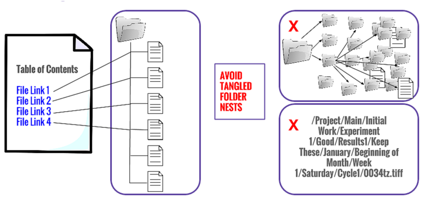

# Why are structured directories important?
{: .no_toc }

Now, let’s pretend that you store everything on your computer in one single folder – some of us are probably known to use our desktops for this. Imagine how long it would take you to find data you collected on a specific day a few years ago. 

<p style="margin-top:25px">

</p>

<p style="margin-bottom:25px">

Instead of keeping every document in a single place, we often organize our files using directory or folder structures. This helps us save precious time and improve our productivity. Organizing folders can also help us collaborate more effectively by ensuring that everyone can find the files they need.

<details open markdown="block">
  <summary>
    Table of contents
  </summary>
  {: .text-delta }
 - TOC
{:toc}
</details>


<p style="margin-bottom: 30px"></p>



<p style="margin-bottom: 50px"></p>

---

# Directory Hierarchies
  
A typical directory structure is composed of a **root directory** (i.e. top-level folder), **subdirectories** (i.e. subfolders), and relevant **files**.

The structure looks like this:   

```
├── Project-Folder/
|   ├── Experiment-Data/
|   |   ├── File-1
|   |   ├── File-2
|   ├── Experiment-Analysis/
|   |   ├── File-1
|   ├── Experiment-Report/
|   |   ├── File-1
|   |   ├── File-2
```


Directory names are frequently followed by a slash- / -to differentiate them from files. 
{: .note}

Question
{: .label .label-green}
<p style="margin-bottom: 10px"></p>
Which ones in this example are root directories? What about subdirectories?

# README Files and Data Dictionaries 
README files and Data Dictionaries - containing a brief description of the major folder contents, naming conventions, and data structure - are critical for transparency and reproducibility because they allow others to easily understand the contents of your directory and data without needing to ask the creator. This is especially helpful when working with a group or sharing directories with others.

Click [here](content/03_create_readme.md) to review how to create a README file!
{: .note}

<p style="margin-bottom: 30px"></p>


<p style="margin-bottom: 30px"></p>

## We need three files to store all metadata:
1. A ```_README``` file which resides in our **root directory** and elaborates on the contents of our folder structure.
2. A ```_README``` file that resides in our **data directory** and discusses some of the particulars of the how, where, and who did the actual data collection.
3. A ```_DATA-DICTIONARY``` file that also resides in our data directory and elaborates on how our data is stored and organized.

Visually, the stucture looks like this:

```
├── Project-Folder/
|   ├── _README.md                  <--
|   ├── Experiment-Data/
|   |   ├── _DATA-DICTIONARY.md     <--
|   |   ├── _README.txt             <--
|   |   ├── File-1
|   |   ├── File-2
|   ├── Experiment-Analysis/
|   |   ├── File-1
|   ├── Experiment-Report/
|   |   ├── File-1
|   |   ├── File-2
```

```_README``` should exist in at least two locations: the root directory and the data directory.
{: .note}


### Naming
```_README``` and ```_DATA-DICTIONARY``` should be the first things you look at when looking at any directory or folder, as this is your guide to its contents. Therefore these files should
- Be prepended with an underscore "_". This will push these files to the top of the directory for easy access;
- Be in all caps, so they really stand out.


### Format
```_README``` and ```_DATA-DICTIONARY``` files should be written in plain text, for this will ensure that the files describing your project can be opened on any computer. You will often see readme files called ```_README.txt``` or ```_README.md```.

<p style="margin-bottom: 30px"></p>

## Exercise


Say you’re in BIOL 116 and you’re working on your research project. You have files that looked like the following before submitting our final assignment:

```
Pither_20210921_BIOL116RProject_ph-data.csv
Pither_20210922_BIOL116RProject_ph-data.csv
Pither_20210923_BIOL116RProject_ph-data.csv
Pither_20210924_BIOL116RProject_ph-data.csv
Pither_BIOL116RProject_Analysis_V0.xlsx
Pither_BIOL116RProject_Figure-freq-plot_V0.png
Pither_BIOL116RProject_Figure-linear-reg_V0.png
Pither_BIOL116RProject_Figure-linear-reg_V1.png
Pither_BIOL116RProject_Lab-report_V0.docx
Pither_BIOL116RProject_Lab-report_V1.docx
Pither_BIOL116RProject_Lab-report_V2.docx
Pither_BIOL116RProject_Lab-report_V3.docx
```

<p style="margin-bottom: 30px"></p>


<p style="margin-bottom: 30px"></p>

Let's put them into structured folders! Please copy the template and use it for your exercise:

```
├── example/
|   ├── example/           
|   |   ├── example

```

Feel free to refer to the example that we saw earlier:

```
├── Project-Folder/
|   ├── _README.md                  
|   ├── Experiment-Data/
|   |   ├── _DATA-DICTIONARY.md     
|   |   ├── _README.txt             
|   |   ├── File-1
|   |   ├── File-2
|   ├── Experiment-Analysis/
|   |   ├── File-1
|   ├── Experiment-Report/
|   |   ├── File-1
|   |   ├── File-2
```

[//]: # (activity link: https://bit.ly/rdmactivity)


<br>

# Congrats!
{: .no_toc }

<p style="margin-top:25px">

</p>
  
You know how to create structured directories for files now! Go ahead and organize your important personal or team files! 


<br>

---


### Sources
{: .no_toc }
- New York University Libraries. <https://guides.nyu.edu/data_management/file-org>
- Copeland, C., Pither, J., Vis-Dunbar, M. (2021). Procedures and Guidelines. <https://ubco-biology.github.io/Procedures-and-Guidelines/>
- <https://pixabay.com>
- <https://www.pexels.com>